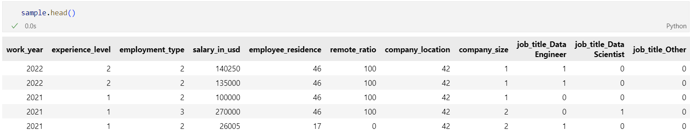

# Machine Learning, Kaggle Competition 🤖

#### Goal: Be the most accurate in forecasting the salaries of Data Jobs

## 1st- Data Cleaning Steps 📋




- 1st: delete "salary" and "Salary currency" from sample as those columns are not available data in the test part.  
- 2nd: Groupby experience level, mean of each and change the strings by labels in descending order  

```
sample.groupby('experience_level')['salary_in_usd'].mean().sort_values(ascending=False)

```
```
sample.experience_level = sample.experience_level.replace(dict(zip(dic, [e for e in range(len(dic))])))
test.experience_level = test.experience_level.replace(dict(zip(dic, [e for e in range(len(dic))])))
```
- 3rd: Same for employment type, company size, company location and employee_residence
    - In the test part some locations were new, I filled them with the average label from the sample size. 

- 4th: For the job title I look for the terms "scien" or "machine learning", "analyst", "engineer" and ranked all results in 4 columns: 
    - Data Scientist
    - Data Analyst
    - Data Engineer
    - Other
    I then replaced the current strings by the category of job and made transformed it with getdummies.  


## 2nd- Machine Learning 🤖

Machine Learning: 
- 1st: tts on Sample to train the model.  
- 2nd: Normalize using fit_transform.  
- 3rd: Lazy to find the best model.  
- 4th: Apply the best model based on Lazy, PoissonRegressor. Train it on the Sample.  
- 5th: Apply it to the test  

